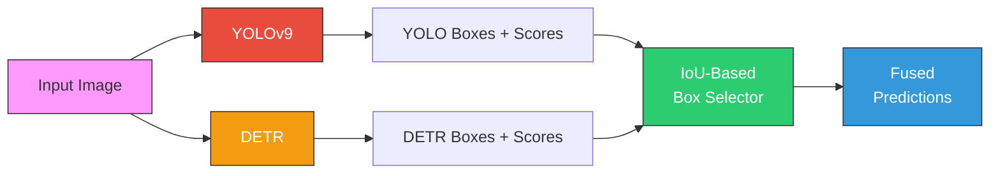

<div align="center">

# Hybrid YOLOv9-DETR for Strawberry Disease Detection

**A hybrid object-detection pipeline that fuses YOLOv9 speed with DETR transformer precision to detect strawberry diseases and ripeness states.**

[](https://python.org)
[](https://docs.ultralytics.com)
[](https://huggingface.co/facebook/detr-resnet-50)
[](LICENSE)
[](https://colab.research.google.com/github/AmirmasoudGhorbani/hybrid-yolov9-detr-strawberry-disease/blob/main/notebooks/demo.ipynb)
[](https://huggingface.co/spaces/Amir-masoud-gh96/hybrid-yolov9-detr-strawberry)

[Live Demo](#-live-demo) · [Quick Start](#-quick-start) · [Results](#-results) · [Architecture](#-architecture) · [CLI Usage](#-cli-inference) · [Training Pipeline](#-training-pipeline) · [Citation](#-citation)

</div>

---

<!-- Add your own sample result image here:

-->

## Live Demo

**[Try the model in your browser](https://huggingface.co/spaces/Amir-masoud-gh96/hybrid-yolov9-detr-strawberry)** — upload any strawberry image and get instant disease/ripeness predictions with a side-by-side comparison of YOLOv9, DETR, and the hybrid output.

> To deploy your own instance, see [`space/SETUP.md`](space/SETUP.md).

---

## Highlights

- **mAP@0.5 = 0.96** — outperforms both standalone YOLOv9 (0.89) and DETR (0.85)
- **12 disease/ripeness classes** covering the most common strawberry conditions
- **Single-image CLI** — run `python -m src.predict --image photo.jpg` for instant results
- **Colab notebook** — try it in your browser with zero setup
- **Non-end-to-end design** — keeps inference efficient enough for real-time use

---

## Results

| Metric | YOLOv9 | DETR | Hybrid |
|--------|:------:|:----:|:------:|
| mAP@0.5 | 0.89 | 0.85 | **0.96** |
| mAP@0.75 | 0.79 | 0.81 | **0.92** |
| Precision | 0.68 | 0.64 | **0.82** |
| Recall | 0.73 | 0.69 | **0.85** |

> The hybrid model outperforms both standalone models on every metric. DETR refines YOLO's bounding boxes, improving localisation, while the non-end-to-end design keeps inference efficient.

<!-- Uncomment once you add result images to assets/:
### Visual Comparison

| YOLOv9 Only | DETR Only | Hybrid (Fused) |
|:-----------:|:---------:|:--------------:|
|  |  |  |
-->

---

## Architecture

The hybrid pipeline runs both detectors independently, then fuses their outputs:



**How the fusion works:**
1. For each YOLO box, find DETR boxes with IoU >= 0.5
2. If a DETR box has higher confidence, use it instead
3. Add any DETR-only detections (no YOLO overlap)

This gives us YOLO's speed and recall with DETR's precise localisation.

---

## Quick Start

### Installation

```bash
git clone https://github.com/AmirmasoudGhorbani/hybrid-yolov9-detr-strawberry-disease.git
cd hybrid-yolov9-detr-strawberry-disease
pip install -e .
```

Or without installing as a package:

```bash
pip install -r requirements.txt
```

> A CUDA-capable GPU is strongly recommended for training. CPU works for inference.

### Try the Demo Notebook

[](https://colab.research.google.com/github/AmirmasoudGhorbani/hybrid-yolov9-detr-strawberry-disease/blob/main/notebooks/demo.ipynb)

The notebook walks through loading pre-trained weights, running inference, and visualising results — no training required.

---

## CLI Inference

Run the hybrid model on any strawberry image from the command line.
After `pip install -e .`, you can also use `strawberry-detect` instead of `python -m src.predict`:

```bash
# Single image
python -m src.predict --image path/to/strawberry.jpg

# Save the result
python -m src.predict --image path/to/strawberry.jpg --output result.jpg

# Batch process a folder
python -m src.predict --image-dir path/to/images/ --output-dir results/

# Adjust thresholds
python -m src.predict --image path/to/strawberry.jpg --threshold 0.4 --iou-threshold 0.6

# Use custom model weights
python -m src.predict --image photo.jpg \
    --yolo-weights path/to/best.pt \
    --detr-model path/to/detr_model \
    --detr-processor path/to/detr_processor
```

The CLI produces a 3-panel comparison (YOLO / DETR / Hybrid) by default. Use `--no-comparison` for a single fused image.

---

## Pre-trained Weights

To use the pre-trained weights from the thesis experiments:

1. **Download** the weights from [GitHub Releases](https://github.com/AmirmasoudGhorbani/hybrid-yolov9-detr-strawberry-disease/releases) or the paths below
2. **Update** `src/config.py` to point at your local copies

| Model | File | Description |
|-------|------|-------------|
| YOLOv9 | `best.pt` | Fine-tuned YOLOv9s (stage 2 output) |
| DETR model | `detr_strawberry_model_extrafinetuned/` | Extra-fine-tuned DETR (stage 5 output) |
| DETR processor | `detr_strawberry_processor_extrafinetuned/` | Matching DETR processor |

> **Tip:** To share weights via GitHub Releases, create a release and attach the files as assets. For larger weights, consider hosting on [HuggingFace Hub](https://huggingface.co/docs/hub/repositories-getting-started).

---

## Dataset

12 classes of strawberry diseases and ripeness states, in COCO format (DETR) and YOLO format (YOLOv9):

```
dataset/
├── train/   images/  labels (or _annotations.coco.json)
├── val/     images/  labels
└── test/    images/  labels
```

| # | Class | Type |
|---|-------|------|
| 0 | Angular Leafspot | Disease |
| 1 | Anthracnose Fruit Rot | Disease |
| 2 | Early-Turning | Ripeness |
| 3 | Gray Mold | Disease |
| 4 | Green-Strawberry | Ripeness |
| 5 | Late-Turning | Ripeness |
| 6 | Leaf Spot | Disease |
| 7 | Powdery Mildew Fruit | Disease |
| 8 | Powdery Mildew Leaf | Disease |
| 9 | Red-Turning | Ripeness |
| 10 | Turning | Ripeness |
| 11 | White-Strawberry | Ripeness |

> **Source:** [Roboflow — Strawberry Disease Dataset](https://universe.roboflow.com/)

---

## Training Pipeline

The scripts form a 7-stage pipeline — each stage consumes the weights from the previous one:

| # | Script | Input | Produces |
|---|--------|-------|----------|
| 1 | `train_yolo.py` | Dataset (YOLO format) | YOLOv9 `best.pt` |
| 2 | `finetune_yolo.py` | YOLO `best.pt` | Fine-tuned YOLO weights |
| 3 | `train_detr.py` | Dataset (COCO) + `facebook/detr-resnet-50` | `detr_strawberry_model_2` |
| 4 | `optimize_detr.py` | `detr_strawberry_model_2` | `..._model_finetuned` |
| 5 | `finetune_detr_extra.py` | `..._model_finetuned` | `..._model_extrafinetuned` |
| 6 | `evaluate_detr.py` | `..._model_extrafinetuned` | Metrics (mAP, P/R/F1, confusion matrix) |
| 7 | `hybrid_inference.py` | Fine-tuned YOLO + `..._model_extrafinetuned` | Fused predictions + visualisations |

```bash
# Run the full pipeline in order:
python -m src.train_yolo
python -m src.finetune_yolo
python -m src.train_detr
python -m src.optimize_detr
python -m src.finetune_detr_extra
python -m src.evaluate_detr
python -m src.hybrid_inference
```

### Configuration

All dataset and weight paths are centralised in **`src/config.py`**. The defaults point at Google Drive locations used during the original Colab development. Edit this file once before running — no need to touch individual scripts.

---

## Repository Layout

```
hybrid-yolov9-detr-strawberry-disease/
├── README.md
├── LICENSE
├── pyproject.toml               # package metadata & pip install -e .
├── requirements.txt
├── .gitignore
├── assets/                      # sample images & diagrams
├── notebooks/
│   ├── demo.ipynb               # interactive Colab demo
│   └── retrain_detr.ipynb       # retrain DETR with improvements
├── space/
│   ├── app.py                   # Gradio app for HuggingFace Spaces
│   ├── requirements.txt         # Space-specific dependencies
│   ├── README.md                # HuggingFace Space metadata
│   └── SETUP.md                 # step-by-step deployment guide
└── src/
    ├── config.py                # centralised path & constant configuration
    ├── utils.py                 # shared datasets, Lightning module, IoU, helpers
    ├── predict.py               # CLI inference (single image or batch)
    ├── train_yolo.py            # 1. train YOLOv9s from scratch
    ├── finetune_yolo.py         # 2. fine-tune the best YOLO weights
    ├── train_detr.py            # 3. train DETR (facebook/detr-resnet-50)
    ├── optimize_detr.py         # 4. fine-tune DETR + StepLR + confusion matrix
    ├── finetune_detr_extra.py   # 5. extra DETR fine-tuning pass
    ├── retrain_detr.py          # improved DETR retraining (replaces stages 3-5)
    ├── evaluate_detr.py         # 6. evaluate DETR on the test set
    └── hybrid_inference.py      # 7. YOLO + DETR fusion via IoU-based selection
```

---

## Contributing

Contributions are welcome! To get started:

1. Fork the repository
2. Create a feature branch: `git checkout -b feature/your-feature`
3. Make your changes and commit: `git commit -m "Add your feature"`
4. Push and open a pull request

Please make sure your code follows the existing style and test any changes with a sample image before submitting.

---

## Future Work

- Real-time edge deployment on NVIDIA Jetson / Raspberry Pi
- End-to-end feature fusion between the two detectors for finer class separation
- Multi-spectral imaging to improve early disease detection
- Model distillation for lightweight mobile deployment

---

## Citation

```bibtex
@misc{ghorbani2024hybrid,
  author = {Ghorbani, Amir},
  title  = {Hybrid YOLOv9-DETR for Strawberry Disease Detection},
  year   = {2024},
  url    = {https://github.com/AmirmasoudGhorbani/hybrid-yolov9-detr-strawberry-disease}
}
```

---

## License

Released under the [MIT License](LICENSE).
